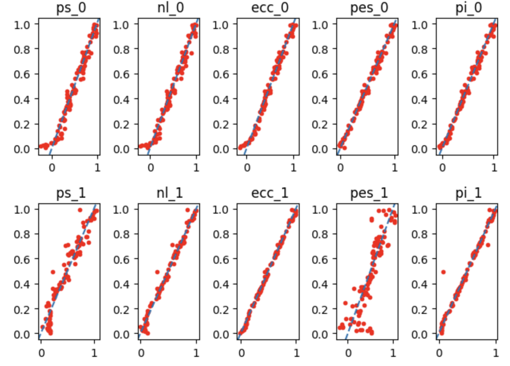

# TDAvec.py

`TDAvec.py` is a python interface to `TDAvec` R package, which is available on [CRAN](https://cran.r-project.org/web/packages/TDAvec/index.html)

First of all, it allows access to all implemented in the original R package vectorizations functions:

* computeAlgebraicFunctions:	Compute Algebraic Functions from a Persistence Diagram
* computeBettiCurve:	A Vector Summary of the Betti Curve
* computeComplexPolynomial:	Compute Complex Polynomial Coefficients from a Persistence Diagram
* computeEulerCharacteristic:	A Vector Summary of the Euler Characteristic Curve
* computeNormalizedLife:	A Vector Summary of the Normalized Life Curve
* computePersistenceBlock:	A Vector Summary of the Persistence Block
* computePersistenceImage:	A Vector Summary of the Persistence Surface
* computePersistenceLandscape:	Vector Summaries of the Persistence Landscape Functions
* computePersistenceSilhouette:	A Vector Summary of the Persistence Silhouette Function
* computePersistentEntropy:	A Vector Summary of the Persistent Entropy Summary Function
* computeStats:	Compute Descriptive Statistics for Births, Deaths, Midpoints, and Lifespans in a Persistence Diagram
* computeTemplateFunction:	Compute a Vectorization of a Persistence Diagram based on Tent Template Functions
* computeTropicalCoordinates:	Compute Tropical Coordinates from a Persistence Diagram

All these functions can easily be called using `tdavec.tdavec_core` package.

In addition, we provide also `sklearn`-type interface to the same functionality, which could be more familiar for python programmers.

Note that the package was tested only on python 3.12. 

# Setup

`TDAvec.py` is available on `pypi`. To install it simply type

    pip install tdavec

into your environment. 

You can also install the current verion from the GitHub with

    pip install -e "git+https://github.com/uislambekov/TDAvec.git#egg=tdavec&subdirectory=python"

Alternatively, you can install it from the source. In order to do this clone mentioned above github repository and run the followin commants from the project root directory:

    pip install numpy==1.26.4 ripser==0.6.8
    python3 setup.py build_ext --inplace
    pip install .

after that you should have `tdavec` package installed in your environment. 

In order to check if the intallation process was completed, you can run python and evaluate the following lines:

    > from tdavec import test_package
    > X, D, PS = test_package()

This function will create a simple point cloud, build a persistence diagram, caclulate the Persistence Silhouette vectorization from it, and return these three objects.

# Usage

In this section some simple example of package usage is demonstrated.

We will start with loading `TDAvec` library and some other packages:

    from tdavec import createEllipse, TDAvectorizer, tdavec_core
    import matplotlib.pyplot as plt
    from sklearn.linear_model import LinearRegression
    from sklearn.model_selection import train_test_split
    from sklearn.metrics import mean_squared_error
    import pandas as pd
    import numpy as np

As a sample data we will work with set of point clouds, that represent defomed elipses with randomly selected squize rations:

    np.random.seed(42)
    epsList = np.random.uniform(low = 0, high = 1, size = 500)
    clouds = [createEllipse(a=1, b=eps, n=100) for eps in epsList]

Here are some examples:

    for i, cl in enumerate(clouds[:4]):
        plt.subplot(2, 2, i+1)
        plt.plot(cl[:,0], cl[:,1], ".")
        plt.xlim(-1.5, 1.5); plt.ylim(-1.5, 1.5)
        plt.title(f"eps={np.round(epsList[i], 2)}")
        plt.grid()
    plt.tight_layout()

In order to generate Persistence Diagrams one need to create TDAvectorizer object and fit fit it:

    v = TDAvectorizer()
    v.setParams({"scale":np.linspace(0, 2, 10)})
    v.fit(clouds)

Here are the examples of the generated persistence diagrams:

    for i in range(4):
        plt.subplot(2,2,i+1)
        PD = v.diags[i]
        for dim in range(2):
            plt.plot(PD[dim][:,0], PD[dim][:,1], ".")
            plt.xlim(0, 2); plt.ylim(0, 2)
            plt.axline( (0,0), slope = 1, linestyle = "--", linewidth = 0.5)
            plt.title(f"eps={np.round(epsList[i], 2)}")
    plt.tight_layout()

Once TDAvectorizer object is fitted, one can calculate vectorization by calling `transorm()` method of this object:

    X = v.transform(output="PS", homDim=1)
    for i, e in enumerate(epsList[:4]):
        plt.plot(v.getParams()["scale"][1:],X[i,:], label=np.round(e, 3))
        plt.xlim(0, 2)
    plt.legend()
    plt.show()

These vectorizations can be used as predictors for ML problem, whose goal is to predict the original deformation parameter. We will use a simple `sklearn.LinearRegression` model to solve the problem

Here is a simple function the for any given set of predictors creates the model, solves it, and retirns the results:

    def makeSim(X, y=epsList):
        Xtrain, Xtest, ytrain, ytest = train_test_split(X, y, train_size=0.8, random_state=42)
        model = LinearRegression().fit(Xtrain, ytrain)
        test_preds = model.predict(Xtest)
        score = model.score(Xtest, ytest)
        res = {"method":method, "homDim":homDim, "test_preds":test_preds, "y_test":ytest, "score":score}
        return res

In the loop below a systematic scan over different vectorizattion methods and homological dimensions is performed:

    v.setParams({"scale":np.linspace(0, 2, 30)})
    methodList = v.vectorization_names
    results = []
    df = pd.DataFrame()
    for homDim in [0, 1]:
        print(f" Dimension {homDim}: ", end=" ")
        for method in methodList[:-2]:
            print(method, end = " ")
            X =v.transform(output=method, homDim=homDim)
            res = makeSim(X); results.append(res)
            df = pd.concat([df, pd.DataFrame(res)])
        print()

Here is the table of calculated accuracies:

| method/dimension   | 0     |     1 |
|:---------|:------|------:|
| ecc      | 0.976 | 0.996 |
| vab      | 0.976 | 0.986 |
| fda      | 0.983 | 0.985 |
| nl       | 0.96  | 0.981 |
| poly     | 0.967 | 0.975 |
| algebra  | 0.971 | 0.955 |
| ps       | 0.946 | 0.914 |
| stats    | 0.987 | 0.887 |
| pes      | 0.989 | 0.717 |
| pi       | 0.986 | 0.547 |

As you can see, majority off them are very close to 1, which means that the models are pretty accurate. Presented belowe truth/predictions scatter plots confirm this conslusion:

